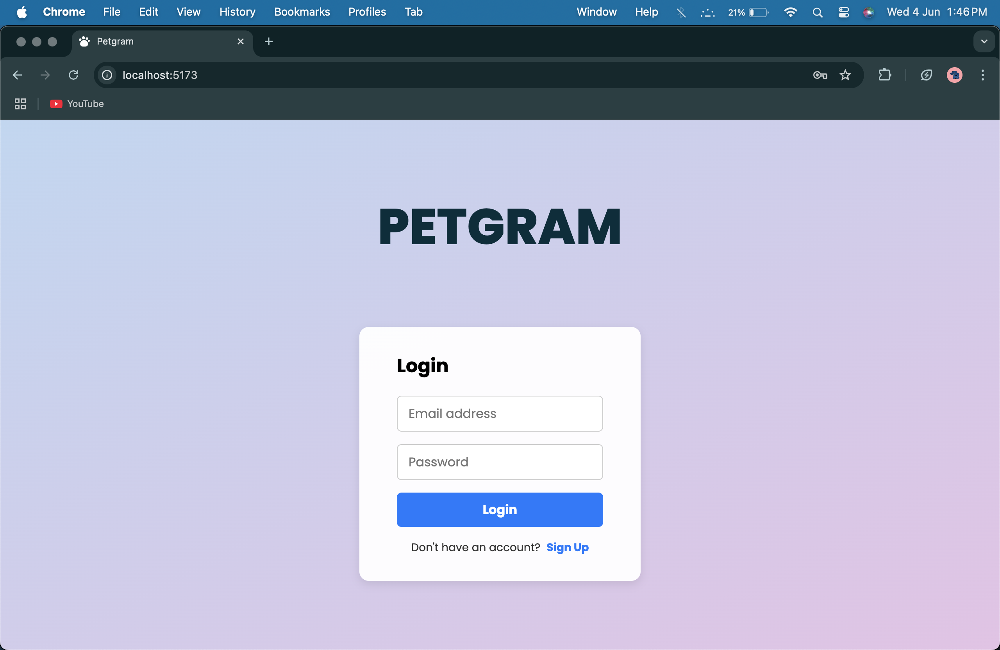
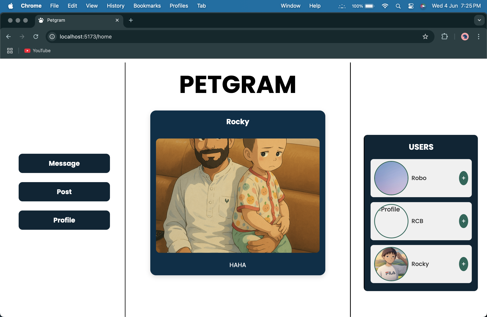
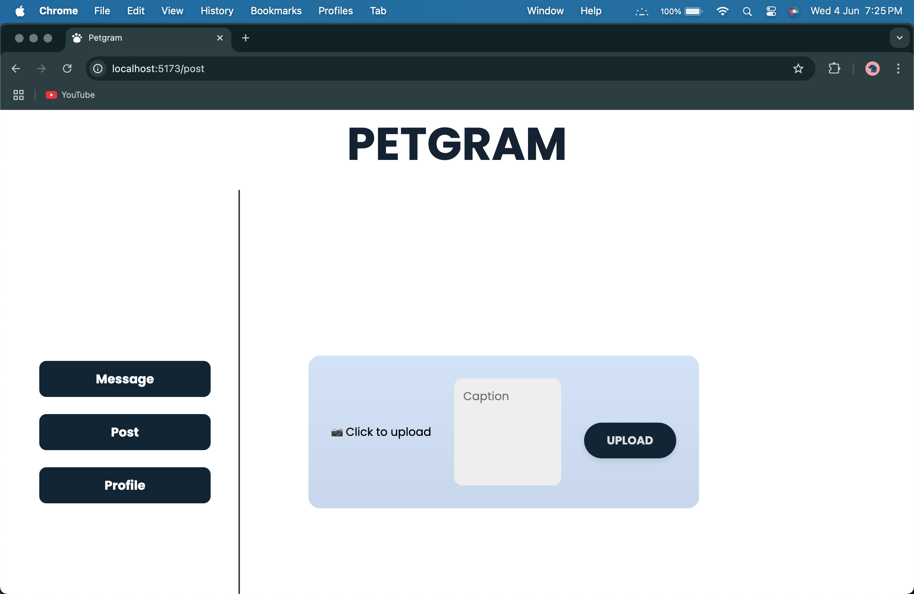
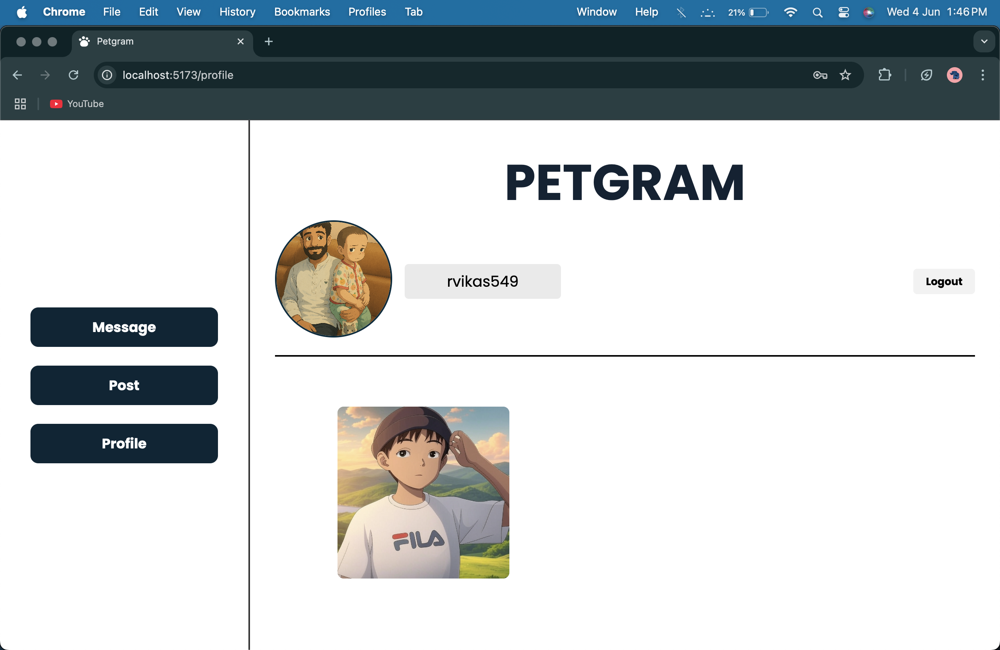
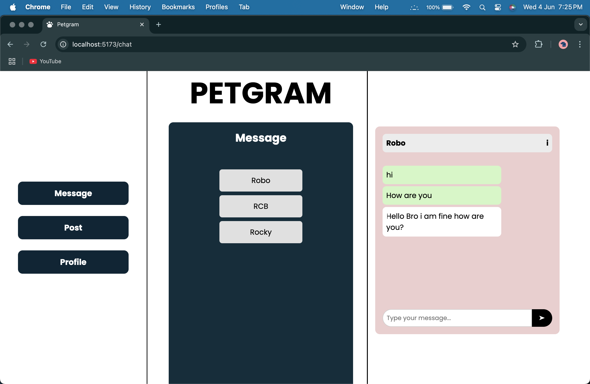

# 🐾 Petgram – Social Media for Pet Lovers

Petgram is a full-stack social media web application built with the **MERN Stack (MongoDB, Express.js, React, Node.js)**, featuring **Firebase Authentication**, **Cloudinary image uploads**, and **Socket.io**-based real-time chat. Users can post pet photos, chat with friends, and engage with content through likes and comments.

---

## 📸 Screenshots

| Login | Feed | Upload Post |
|:--:|:--:|:--:|
|  |  |  |

| Profile | Chat |
|:--:|:--:|
|  |  |

---

## 🧠 Features

### 🔐 Authentication
- Firebase Email/Password login and signup
- Global AuthContext for user state

### 📰 Feed Page
- View posts from yourself and friends
- Like and comment on posts
- Friend suggestions

### 📤 Upload Post
- Upload images with captions
- Stored on **Cloudinary**, metadata saved in MongoDB

### 👤 Profile Page
- View user profile and personal posts
- Upload/change profile picture
- Logout functionality

### 💬 Chat System
- Real-time messaging with friends using **Socket.io**
- Display recent chats
- Message history stored in MongoDB

---

## 🧱 Tech Stack

| Layer | Technology |
|-------|------------|
| Frontend | React.js + CSS |
| Backend | Node.js + Express |
| Database | MongoDB (Mongoose) |
| Authentication | Firebase Auth |
| Media Storage | Cloudinary |
| Real-time Chat | Socket.io |
| State Management | React Context API |

---

## 📁 Project Structure (Frontend)
src/
├── assets/
├── components/
│ ├── Navbar.jsx
│ ├── PostCard.jsx
│ ├── ChatBox.jsx
│ ├── FriendList.jsx
├── context/
│ ├── AuthContext.jsx
│ ├── ChatContext.jsx
├── pages/
│ ├── Login.jsx
│ ├── Feed.jsx
│ ├── UploadPost.jsx
│ ├── Profile.jsx
│ └── Chat.jsx
├── utils/
│ └── api.js
└── App.jsx


---

## ⚙️ Setup Instructions

### 1. Clone the Repo
```bash
git clone https://github.com/your-username/petgram.git
cd petgram
### 2. Setup Environment Variables

### 3. npm i for both Server and Client

### 4. npm run dev for Client

### 5. nodemon index.js for Server

### 6. Create Firebase, MongoDB, Cloudinary credentials and start the PETGRAM

Make any changes if you love this project Thank You😁


